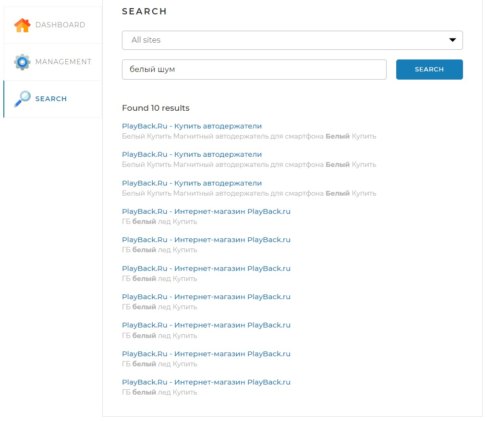
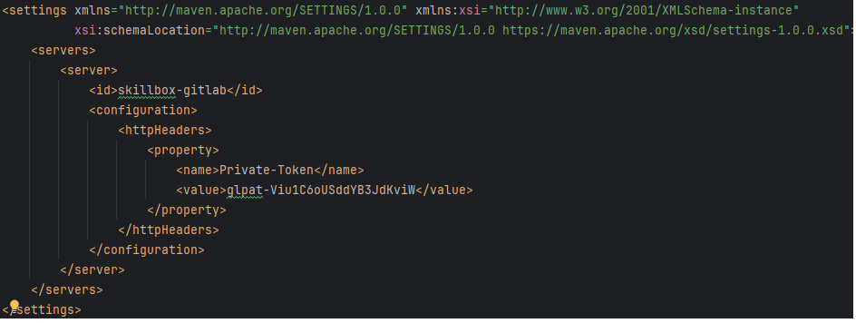

# search-engine
This is search engine for several sites. There many like it, but this one is mine.

For usig this project, you need to install database 
MySQL and create database "search-engine" in localhost. You can see detailed connection propertyes in file application.yaml. 
Also you need to modificate file settings.xml for getting acess to morfology repositoryes. You need to adding this text:
